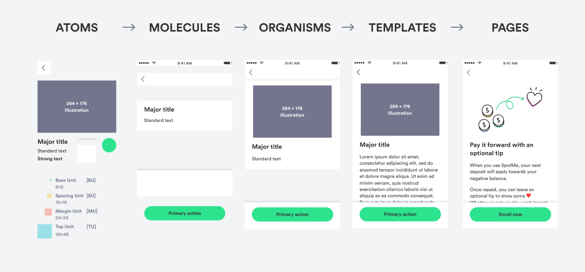

# Atomic Design

Atomic Design is a methodology for creating design systems. It is a way of thinking about how to create components and design systems in a way that is flexible and scalable.

https://bradfrost.com/blog/post/atomic-web-design/
