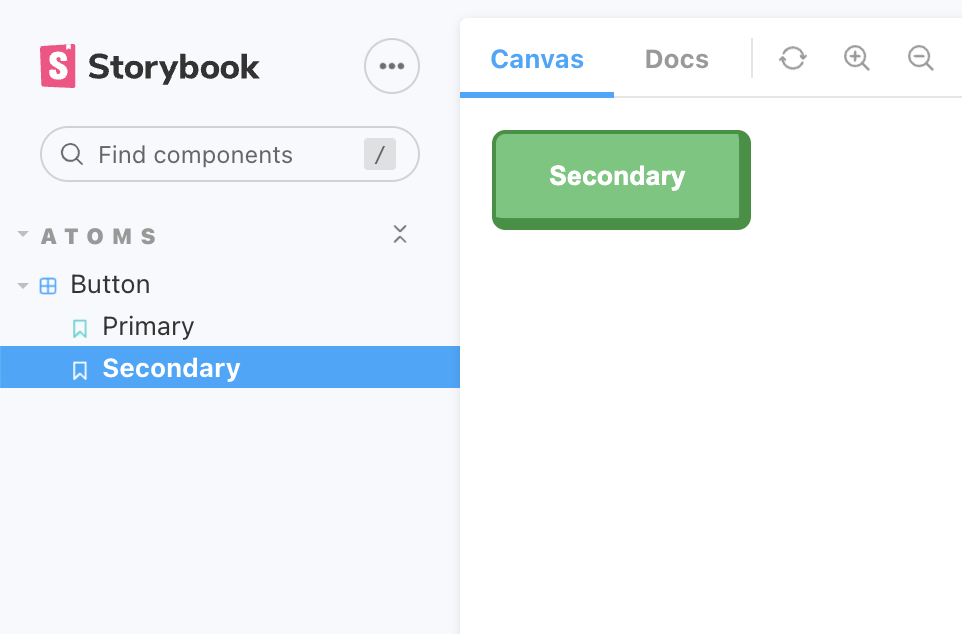

# Storybook

Storybook is a development environment for UI components. It allows you to browse a component library, view the different states of each component, and interactively develop and test components.



## Getting Started

Run storybook with the following command:

```bash
$ npm run storybook
```

Open [http://localhost:6006](http://localhost:6006) to view it in the browser.

## Adding a new story

To add a new story, create a new file in the `stories` directory. The file name should be the name of the component you are creating a story for. For example, if you are creating a story for the `Button` component, name the file `Button.stories.tsx`.
